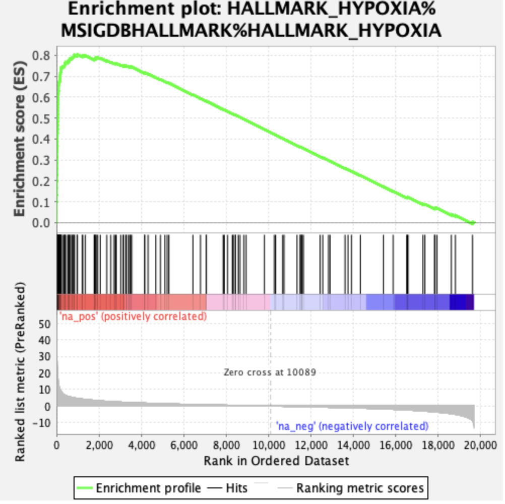
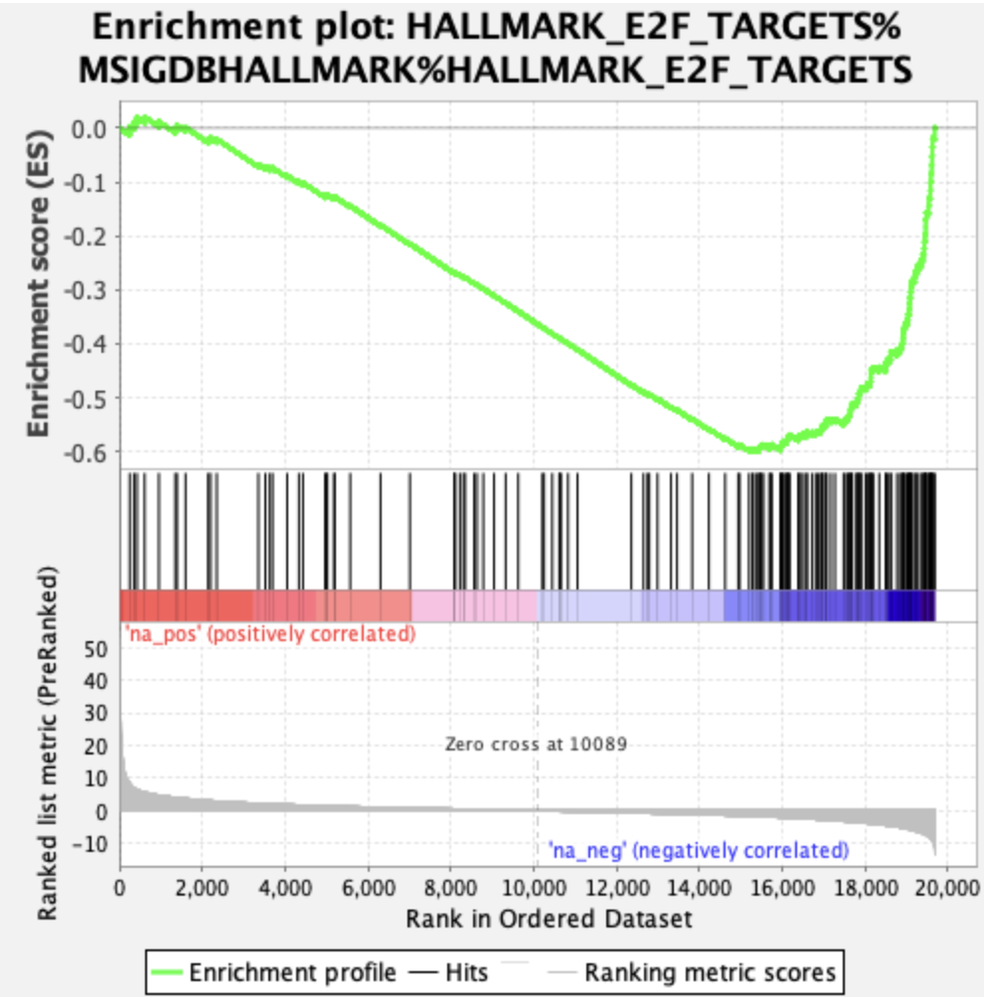
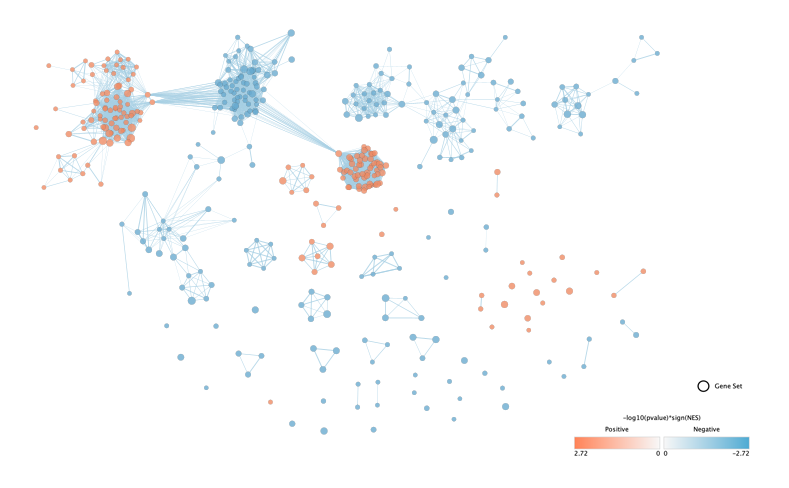
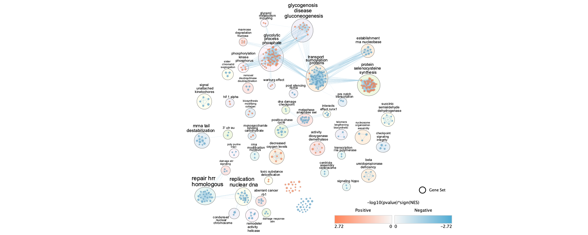
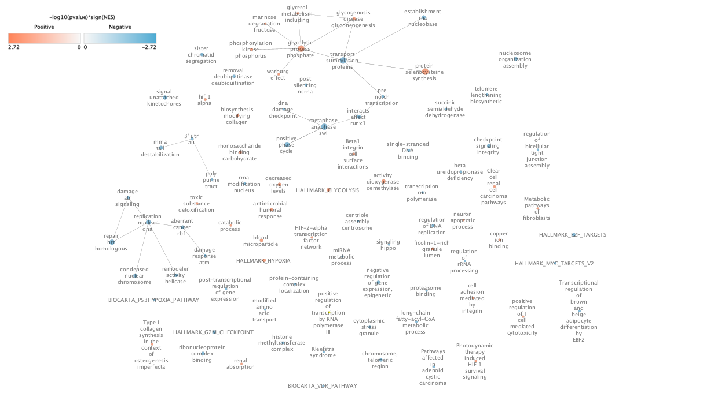

# A2

In A1, I selected and processed the dataset GSE298563, which profiles RPMI 2650 sinonasal squamous cell carcinoma (SNSCC) cells under normoxia (21% O₂) versus hypoxia (1% O₂) over 24 hours @you_sncc_2026. I downloaded the raw count data from GEO and assessed data quality through library size comparisons, sample-to-sample Pearson correlations, and hierarchical clustering, which confirmed high replicate reproducibility and clear condition separation. I then filtered lowly expressed genes using edgeR's filterByExpr function and applied TMM normalization for exploratory visualization, including boxplots, density plots, and MDS analysis, which showed tight replicate clustering with no outliers. For the actual differential expression analysis, I used DESeq2 with its own internal median-of-ratios normalization, applying a Wald test and Benjamini-Hochberg correction for multiple testing. Applying thresholds of padj < 0.05 and |log2FC| ≥ 1 yielded 498 DEGs, 406 upregulated and 92 downregulated, representing the transcriptional response of SNSCC cells to hypoxic stress.

# Thresholded over-representation analysis

Using the list of genes derived from A1, I chose to use g:Profiler @raim2023gprofiler for the subsequent enrichment analysis because it compares the gene list against multiple pathway and functional databases, including KEGG, WikiPathways, and Gene Ontology. This approach allows the identification of enriched pathways across several well-curated sources rather than relying on a single database. As a result, it provides a more comprehensive and well-annotated set of biological pathways and functional categories associated with the gene set.

## Annotation Data Used

For the enrichment analysis, I used g:Profiler, which integrates annotations from multiple biological databases. The analysis included Gene Ontology (GO), KEGG, Reactome, WikiPathways, TRANSFAC, miRTarBase, the Human Protein Atlas, CORUM, and the Human Phenotype Ontology. When using GO annotations, electronic annotations were excluded so that the analysis relied only on experimentally supported evidence.

Using multiple databases allows enrichment to be identified across several well-curated sources rather than relying on a single annotation system, resulting in a more comprehensive and well-annotated set of pathways and functional categories associated with the gene list. Additionally, these databases are regularly updated, which improves the reliability and biological relevance of the annotations.

The analysis was performed using the human genome reference GRCh38.p14. The following database versions were used in the analysis:

* GO:MF, GO:CC, GO:BP – BioMart annotations; classes release 2025-03-16 @GeneOntology2021

* KEGG – FTP Release 2024-01-22 @Kanehisa2021

* Reactome – BioMart annotations; classes release 2025-05-23 @Reactome2024

* WikiPathways – release 2025-05-10 @Martens2021

* TRANSFAC – Release 2024.2; classes v2 @Matys2006

* miRTarBase – Release 10.0 @Huang2022

* Human Protein Atlas – annotations from HPA website (2024-10-19); classes script 2025-02-07 @Uhlen2015

* CORUM – version 4.1 (28-11-2022) @Giurgiu2019

* Human Phenotype Ontology – annotations release 05-2025 @Kohler2021


## g:profiler results {#gprofiler-results}

134 significant genesets were returned, all passing an adjusted p-value threshold of p_adj < 0.05. g:profiler highlighted 10 terms. And term size ranging from 7 to 10,000. 

```{r}
library(tidyverse)
library(ggplot2)
library(ggrepel)

# Load data
gprofdf <- read.csv('gProfiler_hsapiens_3-6-2026_10-04-03 PM__intersections.csv')

# Source order & colors (matching g:Profiler style)
source_colors <- c(
  "GO:MF"  = "#DC143C",
  "GO:BP"  = "#FFA500",
  "GO:CC"  = "#32CD32",
  "KEGG"   = "#1E90FF",
  "REAC"   = "#FF69B4",
  "WP"     = "#9370DB",
  "TF"     = "#20B2AA",
  "MIRNA"  = "#FF6347",
  "HPA"    = "#4682B4",
  "CORUM"  = "#8B4513",
  "HP"     = "#2E8B57"
)

source_order <- c("GO:MF", "GO:BP", "GO:CC", "KEGG", "REAC", "WP",
                  "TF", "MIRNA", "HPA", "CORUM", "HP")

# Prep data
gprofdf <- gprofdf %>%
  filter(source %in% names(source_colors), adjusted_p_value > 0) %>%
  mutate(source = factor(source, levels = source_order)) %>%
  arrange(source) %>%
  group_by(source) %>%
  mutate(x_within = row_number()) %>%
  ungroup()

# Compute per-source offsets with gaps between sources
source_sizes <- gprofdf %>%
  group_by(source) %>%
  summarise(n = n(), .groups = "drop") %>%
  arrange(match(source, source_order)) %>%
  mutate(offset = cumsum(lag(n, default = 0)) + (as.integer(factor(source, levels = source_order)) - 1) * 3)

gprofdf <- gprofdf %>%
  left_join(source_sizes, by = "source") %>%
  mutate(x_pos = offset + x_within)

# ---- Use g:Profiler highlighted terms instead of top30 ----
top_labeled <- gprofdf %>%
  filter(highlighted == "true") %>%
  arrange(adjusted_p_value) %>%
  mutate(label_id = row_number())

gprofdf <- gprofdf %>%
  left_join(top_labeled %>% dplyr::select(term_id, label_id), by = "term_id")

# Source midpoints for x-axis
source_mids <- gprofdf %>%
  group_by(source) %>%
  summarise(mid  = mean(x_pos), xmin = min(x_pos) - 0.5, xmax = max(x_pos) + 0.5,
            count = n(), .groups = "drop") %>%
  mutate(source_label = paste0(source, " (", count, ")"))

g_plot <- ggplot(gprofdf, aes(x = x_pos, y = negative_log10_of_adjusted_p_value)) +
  # Background source color bands
  geom_rect(
    data = source_mids,
    aes(xmin = xmin, xmax = xmax, ymin = -Inf, ymax = Inf, fill = source),
    alpha = 0.05, inherit.aes = FALSE
  ) +
  # All points (low alpha for non-highlighted)
  geom_point(
    data = gprofdf %>% filter(is.na(label_id)),
    aes(color = source, size = intersection_size),
    alpha = 0.35, shape = 16
  ) +
  # Highlighted points (full opacity)
  geom_point(
    data = gprofdf %>% filter(!is.na(label_id)),
    aes(color = source, size = intersection_size),
    alpha = 1, shape = 16
  ) +
  # Numeric labels — black, outside aes()
  geom_text_repel(
    data = gprofdf %>% filter(!is.na(label_id)),
    aes(label = label_id),
    color        = "black",
    size         = 3,
    fontface     = "bold",
    box.padding  = 0.4,
    max.overlaps = 50,
    show.legend  = FALSE
  ) +
  # Color bar at bottom mimicking g:Profiler
  geom_tile(
    data = source_mids,
    aes(x = mid, y = -0.6, fill = source,
        width = xmax - xmin, height = 0.5),
    inherit.aes = FALSE
  ) +
  # X-axis source labels
  scale_x_continuous(
    breaks = source_mids$mid,
    labels = source_mids$source_label,
    expand = c(0.01, 0.01)
  ) +
  scale_y_continuous(
    name   = expression(-log[10](p[adj])),
    limits = c(-1, NA),
    expand = expansion(mult = c(0, 0.05))
  ) +
  scale_color_manual(values = source_colors, name = "Source") +
  scale_fill_manual(values  = source_colors, guide = "none") +
  scale_size_continuous(name = "Intersection size", range = c(2, 10),
                        breaks = c(10, 50, 100)) +
  guides(
    color = guide_legend(override.aes = list(size = 4)),
    size  = guide_legend(override.aes = list(color = "grey40"))
  ) +
  labs(
    title = "Functional Enrichment Analysis of DEGs"
  ) +
  theme_classic(base_size = 12) +
  theme(
    axis.title.x       = element_blank(),
    axis.text.x        = element_text(angle = 30, hjust = 1, size = 9),
    axis.ticks.x       = element_blank(),
    panel.grid.major.y = element_line(color = "grey90", linewidth = 0.3),
    legend.position    = "right",
    legend.key.size    = unit(0.4, "cm"),
    legend.text        = element_text(size = 8),
    legend.title       = element_text(size = 9)
  )

print(g_plot)

# Print highlighted terms table
top_labeled %>%
  dplyr::select(label_id, source, term_id, term_name, adjusted_p_value, intersection_size) %>%
  arrange(label_id) %>%
  print(n = 10)

```

**Figure 1** Functional enrichment analysis of 498 DEGs identified significant gene sets across GO:MF, GO:BP, GO:CC, KEGG, REAC, WP, TF, and MIRNA at p_adj < 0.05 (g:Profiler, experimentally validated annotations only, IEA excluded). The Manhattan plot displays each gene set as a circle positioned by database (x-axis) and significance (y-axis, −log₁₀ p_adj), with circle size proportional to intersection size. The 10 driver terms highlighted by g:Profiler represent the most informative, non-redundant gene sets and are labeled 1–10 in order of significance.

The strongest enrichment was observed in GO:BP, with response to hypoxia (p_adj = 1.54×10⁻¹⁵) and nucleoside diphosphate metabolic process (p_adj = 3.31×10⁻¹¹) as the top two driver terms, consistent with the hypoxia-driven transcriptional program previously described in the TC1 malignant cell population in this dataset @you_sncc_2026. Additional driver terms implicated carbohydrate metabolism (carbohydrate kinase activity, carbohydrate binding), multicellular organismal and circulatory system development (multicellular organismal process, circulatory system development, tube development), and homeostatic processes, suggesting that hypoxia broadly remodels metabolic and developmental programs in RPMI 2650 cells.

## Separating upregulated and downregulated

### Downregulated 

92 of the 498 genes were downregulated. When passed through g:profiler 4 terms were returned. 

```{r}
library(tidyverse)
library(ggplot2)
library(ggrepel)

# Load data
gprofdf <- read.csv('gProfiler_hsapiens_3-7-2026_11-47-12 AM__intersections.csv')

# Source order & colors (matching g:Profiler style)
source_colors <- c(
  "GO:MF"  = "#DC143C",
  "GO:BP"  = "#FFA500",
  "GO:CC"  = "#32CD32",
  "KEGG"   = "#1E90FF",
  "REAC"   = "#FF69B4",
  "WP"     = "#9370DB",
  "TF"     = "#20B2AA",
  "MIRNA"  = "#FF6347",
  "HPA"    = "#4682B4",
  "CORUM"  = "#8B4513",
  "HP"     = "#2E8B57"
)

source_order <- c("GO:MF", "GO:BP", "GO:CC", "KEGG", "REAC", "WP",
                  "TF", "MIRNA", "HPA", "CORUM", "HP")

# Prep data
gprofdf <- gprofdf %>%
  filter(source %in% names(source_colors), adjusted_p_value > 0) %>%
  mutate(source = factor(source, levels = source_order)) %>%
  arrange(source) %>%
  group_by(source) %>%
  mutate(x_within = row_number()) %>%
  ungroup()

# Compute per-source offsets with gaps between sources
source_sizes <- gprofdf %>%
  group_by(source) %>%
  summarise(n = n(), .groups = "drop") %>%
  arrange(match(source, source_order)) %>%
  mutate(offset = cumsum(lag(n, default = 0)) + (as.integer(factor(source, levels = source_order)) - 1) * 3)

gprofdf <- gprofdf %>%
  left_join(source_sizes, by = "source") %>%
  mutate(x_pos = offset + x_within)

# ---- Use g:Profiler highlighted terms instead of top30 ----
top_labeled <- gprofdf %>%
  filter(highlighted == "true") %>%
  arrange(adjusted_p_value) %>%
  mutate(label_id = row_number())

gprofdf <- gprofdf %>%
  left_join(top_labeled %>% dplyr::select(term_id, label_id), by = "term_id")

# Source midpoints for x-axis
source_mids <- gprofdf %>%
  group_by(source) %>%
  summarise(mid  = mean(x_pos), xmin = min(x_pos) - 0.5, xmax = max(x_pos) + 0.5,
            count = n(), .groups = "drop") %>%
  mutate(source_label = paste0(source, " (", count, ")"))

g_plot <- ggplot(gprofdf, aes(x = x_pos, y = negative_log10_of_adjusted_p_value)) +
  # Background source color bands
  geom_rect(
    data = source_mids,
    aes(xmin = xmin, xmax = xmax, ymin = -Inf, ymax = Inf, fill = source),
    alpha = 0.05, inherit.aes = FALSE
  ) +
  # All points (low alpha for non-highlighted)
  geom_point(
    data = gprofdf %>% filter(is.na(label_id)),
    aes(color = source, size = intersection_size),
    alpha = 0.35, shape = 16
  ) +
  # Highlighted points (full opacity)
  geom_point(
    data = gprofdf %>% filter(!is.na(label_id)),
    aes(color = source, size = intersection_size),
    alpha = 1, shape = 16
  ) +
  # Numeric labels — black, outside aes()
  geom_text_repel(
    data = gprofdf %>% filter(!is.na(label_id)),
    aes(label = label_id),
    color        = "black",
    size         = 3,
    fontface     = "bold",
    box.padding  = 0.4,
    max.overlaps = 50,
    show.legend  = FALSE
  ) +
  # Color bar at bottom mimicking g:Profiler
  geom_tile(
    data = source_mids,
    aes(x = mid, y = -0.6, fill = source,
        width = xmax - xmin, height = 0.5),
    inherit.aes = FALSE
  ) +
  # X-axis source labels
  scale_x_continuous(
    breaks = source_mids$mid,
    labels = source_mids$source_label,
    expand = c(0.01, 0.01)
  ) +
  scale_y_continuous(
    name   = expression(-log[10](p[adj])),
    limits = c(-1, NA),
    expand = expansion(mult = c(0, 0.05))
  ) +
  scale_color_manual(values = source_colors, name = "Source") +
  scale_fill_manual(values  = source_colors, guide = "none") +
  scale_size_continuous(name = "Intersection size", range = c(2, 10),
                        breaks = c(10, 50, 100)) +
  guides(
    color = guide_legend(override.aes = list(size = 4)),
    size  = guide_legend(override.aes = list(color = "grey40"))
  ) +
  labs(
    title = "Functional Enrichment Analysis of Downregulated genes"
  ) +
  theme_classic(base_size = 10) +
  theme(
    axis.title.x       = element_blank(),
    axis.text.x        = element_text(angle = 30, hjust = 1, size = 9),
    axis.ticks.x       = element_blank(),
    panel.grid.major.y = element_line(color = "grey90", linewidth = 0.3),
    legend.position    = "right",
    legend.key.size    = unit(0.4, "cm"),
    legend.text        = element_text(size = 8),
    legend.title       = element_text(size = 9)
  )

print(g_plot)

# Print highlighted terms table
top_labeled %>%
  dplyr::select(label_id, source, term_id, term_name, adjusted_p_value, intersection_size) %>%
  arrange(label_id) %>%
  print(n = 2)

```

**Figure 2** Functional enrichment analysis of 92 downregulated DEGs returned only 4 significant gene sets at p_adj < 0.05, spanning GO:MF (2 terms) and GO:BP (2 terms). The 2 g:Profiler driver terms are labeled in order of significance.

The limited enrichment signal is consistent with the small input size (92 genes). The two driver terms; metal ion transport (GO:BP, p_adj = 7.61×10⁻³) and monoatomic cation transmembrane transporter activity (GO:MF, p_adj = 3.61×10⁻²) converge on the same biological theme, suggesting that hypoxia selectively suppresses ion transport and channel activity in RPMI 2650 cells.

### Upregulated

406 were upregulated. When passed through g:profiler 163 terms were returned. 

```{r}
if (!requireNamespace("tidyverse", quietly = TRUE)) {
  install.packages("tidyverse")
}
library(tidyverse)
library(ggplot2)
library(ggrepel)

# Load data
gprofdf <- read.csv('gProfiler_hsapiens_3-7-2026_12-49-11 PM__intersections.csv')

# Source order & colors (matching g:Profiler style)
source_colors <- c(
  "GO:MF"  = "#DC143C",
  "GO:BP"  = "#FFA500",
  "GO:CC"  = "#32CD32",
  "KEGG"   = "#1E90FF",
  "REAC"   = "#FF69B4",
  "WP"     = "#9370DB",
  "TF"     = "#20B2AA",
  "MIRNA"  = "#FF6347",
  "HPA"    = "#4682B4",
  "CORUM"  = "#8B4513",
  "HP"     = "#2E8B57"
)

source_order <- c("GO:MF", "GO:BP", "GO:CC", "KEGG", "REAC", "WP",
                  "TF", "MIRNA", "HPA", "CORUM", "HP")

# Prep data
gprofdf <- gprofdf %>%
  filter(source %in% names(source_colors), adjusted_p_value > 0) %>%
  mutate(source = factor(source, levels = source_order)) %>%
  arrange(source) %>%
  group_by(source) %>%
  mutate(x_within = row_number()) %>%
  ungroup()

# Compute per-source offsets with gaps between sources
source_sizes <- gprofdf %>%
  group_by(source) %>%
  summarise(n = n(), .groups = "drop") %>%
  arrange(match(source, source_order)) %>%
  mutate(offset = cumsum(lag(n, default = 0)) + (as.integer(factor(source, levels = source_order)) - 1) * 3)

gprofdf <- gprofdf %>%
  left_join(source_sizes, by = "source") %>%
  mutate(x_pos = offset + x_within)

# ---- Use g:Profiler highlighted terms instead of top30 ----
top_labeled <- gprofdf %>%
  filter(highlighted == "true") %>%
  arrange(adjusted_p_value) %>%
  mutate(label_id = row_number())

gprofdf <- gprofdf %>%
  left_join(top_labeled %>% dplyr::select(term_id, label_id), by = "term_id")

# Source midpoints for x-axis
source_mids <- gprofdf %>%
  group_by(source) %>%
  summarise(mid  = mean(x_pos), xmin = min(x_pos) - 0.5, xmax = max(x_pos) + 0.5,
            count = n(), .groups = "drop") %>%
  mutate(source_label = paste0(source, " (", count, ")"))

g_plot <- ggplot(gprofdf, aes(x = x_pos, y = negative_log10_of_adjusted_p_value)) +
  # Background source color bands
  geom_rect(
    data = source_mids,
    aes(xmin = xmin, xmax = xmax, ymin = -Inf, ymax = Inf, fill = source),
    alpha = 0.05, inherit.aes = FALSE
  ) +
  # All points (low alpha for non-highlighted)
  geom_point(
    data = gprofdf %>% filter(is.na(label_id)),
    aes(color = source, size = intersection_size),
    alpha = 0.35, shape = 16
  ) +
  # Highlighted points (full opacity)
  geom_point(
    data = gprofdf %>% filter(!is.na(label_id)),
    aes(color = source, size = intersection_size),
    alpha = 1, shape = 16
  ) +
  # Numeric labels — black, outside aes()
  geom_text_repel(
    data = gprofdf %>% filter(!is.na(label_id)),
    aes(label = label_id),
    color        = "black",
    size         = 3,
    fontface     = "bold",
    box.padding  = 0.4,
    max.overlaps = 50,
    show.legend  = FALSE
  ) +
  # Color bar at bottom mimicking g:Profiler
  geom_tile(
    data = source_mids,
    aes(x = mid, y = -0.6, fill = source,
        width = xmax - xmin, height = 0.5),
    inherit.aes = FALSE
  ) +
  # X-axis source labels
  scale_x_continuous(
    breaks = source_mids$mid,
    labels = source_mids$source_label,
    expand = c(0.01, 0.01)
  ) +
  scale_y_continuous(
    name   = expression(-log[10](p[adj])),
    limits = c(-1, NA),
    expand = expansion(mult = c(0, 0.05))
  ) +
  scale_color_manual(values = source_colors, name = "Source") +
  scale_fill_manual(values  = source_colors, guide = "none") +
  scale_size_continuous(name = "Intersection size", range = c(2, 10),
                        breaks = c(10, 50, 100)) +
  guides(
    color = guide_legend(override.aes = list(size = 4)),
    size  = guide_legend(override.aes = list(color = "grey40"))
  ) +
  labs(
    title = "Functional Enrichment Analysis of Upregulated Genes"
  ) +
  theme_classic(base_size = 10) +
  theme(
    axis.title.x       = element_blank(),
    axis.text.x        = element_text(angle = 30, hjust = 1, size = 9),
    axis.ticks.x       = element_blank(),
    panel.grid.major.y = element_line(color = "grey90", linewidth = 0.3),
    legend.position    = "right",
    legend.key.size    = unit(0.4, "cm"),
    legend.text        = element_text(size = 8),
    legend.title       = element_text(size = 9)
  )

print(g_plot)

# Print highlighted terms table
top_labeled %>%
  dplyr::select(label_id, source, term_id, term_name, adjusted_p_value, intersection_size) %>%
  arrange(label_id) %>%
  print(n = 14)

```

**Figure 3** Functional enrichment analysis of 406 upregulated DEGs identified significant gene sets across GO:MF, GO:BP, GO:CC, KEGG, REAC, WP, TF, and MIRNA at p_adj < 0.05 (g:Profiler, experimentally validated annotations only, IEA excluded). The Manhattan plot displays each gene set as a circle positioned by database (x-axis) and significance (y-axis, −log₁₀ p_adj), with circle size proportional to intersection size. The 14 driver terms highlighted by g:Profiler, representing the most informative, non-redundant gene sets, are labeled 1–14 in order of significance.

The strongest enrichment was observed in GO:BP, with response to hypoxia (p_adj = 4.57×10⁻¹⁶) and nucleoside diphosphate metabolic process (p_adj = 2.25×10⁻¹²) as the top two driver terms, consistent with the hypoxia-driven transcriptional program previously described in the TC1 malignant cell population in this dataset @. Additional driver terms implicated carbohydrate metabolism (carbohydrate kinase activity, carbohydrate biosynthetic process, carbohydrate binding), circulatory system and tube development, and phosphotransferase activity, suggesting that hypoxia broadly remodels metabolic and angiogenic programs in RPMI 2650 cells

## Discussion of Threshold ORA results 

Running the analyses separately is more informative than using the combined list because it preserves directionality. The upregulated analysis confirms and expands the hypoxia-glycolysis-angiogenesis program described in the original paper, while the downregulated analysis reveals suppression of ion transport to conserve ATP this was not highlighted in the combined run, suggesting that analyzing the full DEG list together risks missing biologically meaningful signals that only emerge when up and downregulated genes are considered independently.

### Results Compared to Original Paper and Other Publications

There is a clear hypoxia response, which is the original paper's central claim. You et al. identified TC1 as a hypoxic malignant subpopulation  with activated hypoxia and glycolysis signatures which is confirmed by the above driver terms. Moreover, the paper also stipulates how TC1 hypoxic cells secrete ADM, MIF, and VEGFA to activate endothelial tip cells promoting angiogenesis. One of the driver terms above included circulatory system development and tube development and VEGFA is also in the DEG gene list.

Miar et al. (2020) provides supporting evidence for both the upregulated and downregulated enrichment results. The study confirms that HIF-1α directly drives transcription of glycolytic genes under hypoxia — including PDK1, PGK1, P4HA1, and NDRG1, several of which appear in my upregulated gene list. Additionally, the paper demonstrates that hypoxia causes a 42–65% decrease in total RNA transcription after 24–48 hours, which helps explain why my downregulated gene set of 92 genes returned only 2 driver terms, hypoxic transcriptional suppression is broad and diffused rather than coordinated around a single pathway, making it harder to detect enrichment. This also supports the conclusion that running the upregulated and downregulated sets separately is more informative, as the downregulated signal would be further diluted in a combined analysis. Finally, Miar et al. show that hypoxia decreases chromatin accessibility at STAT1 and IRF3 motifs, consistent with the finding in You et al. that AP-1 transcription factors (FOSL2, JUNB) gain accessibility in hypoxic tumor cells, which may explain the large TF enrichment cluster observed in my upregulated Manhattan plot @you_sncc_2026 @miar_hypoxia_2020. 

# Non-thresholded Gene set Enrichment Analysis

I will be using GSEAPreranked @subramanian2005gsea for non-thresholded gene set enrichment analysis as it uses the full ranked gene list so that all genes contribute to enrichment scores which makes it better suited for detecting broad, diffused transcriptional suppression. I used the Bader lab's September 1st, 2025 human gene-set with no IEA pathways will all GO BP and no PFOCR pathways. Minimum size of the geneset was set as 15 and maximum size was set at 200 with 1000 permutations and no remapping of symbols. My list of genes was arranged by Wald statistic as I wanted to use a statistic that gave directionality and significance. 

## Results 

3106 / 7233 gene sets are upregulated in hypoxia and 439 gene sets are significant at FDR < 25%, 317 gene sets are significantly enriched at nominal pvalue < 1%, and 517 gene sets are significantly enriched at nominal pvalue < 5%. In normoxia, 4127 / 7233 gene sets are upregulated, 1404 gene sets are significantly enriched at FDR < 25%, 640 gene sets are significantly enriched at nominal pvalue < 1%, and 1193 gene sets are significantly enriched at nominal pvalue < 5%.

### Upregulation in Hypoxia 

The top upregulated enriched gene set was HALLMARK_HYPOXIA (MSigDB) with a gene set size of 133, an enrichment score of 0.804326 (NES = 3.0460753), a nominal p-value of 0.0, an FDR q-value of 0.0, and an FWER p-value of 0.0. The top gene driving this enrichment was DDIT4, a stress response protein that acts as a potent inhibitor of the mTORC1 pathway, is upregulated under hypoxia, and is associated with poor tumor prognosis @fattahi_high_2021.



**Figure 4.** GSEA enrichment plot for the HALLMARK_HYPOXIA gene set. The enrichment score (ES) curve peaks at approximately 0.80 early in the ranked list, indicating strong enrichment of hypoxia hallmark genes among the most upregulated genes in RPMI 2650 cells exposed to hypoxia (1% O₂) versus normoxia (21% O₂). Black vertical lines indicate the positions of individual gene set members across the ranked list. The ranked list metric (grey curve) shows Wald statistics from most positively correlated (na_pos, left) to most negatively correlated (na_neg, right), with zero crossing at rank 10,089. Gene set size and FDR q-value are reported in the main text.

The results indicates that the hypoxia transcriptional program is a dominant and statistically robust signal in the hypoxic group. The steep early rise of the enrichment curve to a peak ES of 0.806 shows that hypoxia hallmark genes are not randomly distributed across the ranked list but are instead massively concentrated among the most upregulated genes in RPMI 2650 cells exposed to 1% O₂.

## Downregulation in Hypoxia 

The top enriched gene set is HALLMARK_E2F_TARGETS (MSigDB) it has a gene set size of 160, an enrichment score of -0.5998046 (NES equals -2.5229883), nominal p value of 0.0, FDR q-value of 0..0 and FWER p-value of 0.0. The top gene driving this enrichment is AK2.


**Figure 5.**GSEA enrichment plot for the HALLMARK_E2F_TARGETS gene set. The enrichment score curve declines steadily from the start of the ranked list, reaching a minimum ES of approximately -0.60 around rank 15,000, indicating strong enrichment of E2F target genes among the most downregulated genes in RPMI 2650 cells exposed to hypoxia (1% O₂) versus normoxia (21% O₂). Hit bars are visibly denser toward the na_neg end of the ranked list, confirming that E2F targets, primarily cell cycle and proliferation genes, are coherently suppressed under hypoxia. Gene set size, NES, and FDR q-value are reported in the main text.

This result is consistent with the broader metabolic suppression revealed in g:profiler especially as E2F TFs are master regulators of the cell cycle and in hypoxic conditions the cell cycle is stalled to conserve energy @ren_e2f_2002. 

# Method comparison 
Both methods converge on the same core biological story, hypoxia drives a strong and coherent transcriptional reprogramming in RPMI 2650 SNSCC cells. The hypoxia response was the top result in both analyses, with g:Profiler returning response to hypoxia as the top driver term and GSEA returning HALLMARK_HYPOXIA. The metabolic reprogramming signal, glycolysis, carbohydrate metabolism, nucleoside diphosphate metabolic process, was also captured by both methods. On the downregulated side, both methods detected suppression of energetically expensive processes under hypoxia, though GSEA revealed E2F target suppression as the dominant downregulated signal while g:Profiler only returned ion transport terms from the 92 downregulated genes.

However this is not a straightforward comparison as the two methods are using different gene set databases so some differences in results may refletc database coverage rather than true biological differences. g:profiler also used a thresholded binary input of 498 genes while GSEA used all ranked genes and the statistical frameworks used differ. ORA uses hypergeometric testing while GSEA is permutaion-based enrichment scoring so the p-values and FDR values computed are not directly comparable.

Despite these methodological differences, the convergence of both methods on the hypoxia transcriptional program as the dominant signal increases confidence that this is a genuine and robust biological finding rather than a methodological artifact

# Gene set Enrichment Analysis Visualization

I first generated an initial enrichment map using Cytoscape and EnrichmentMap @shannon2003cytoscape @merico2010enrichmentmap. I provided the GSEA results folder and my normalized counts from A1 and the EnrichmentMap was constructed using a Q-value cutoff of 0.01 and an edge similarity cutoff of 0.375, resulting in 412 nodes and 4222 edges. Nodes represent individual gene sets colored by enrichment direction (orange = upregulated in hypoxia, blue = downregulated in hypoxia) and edges connect gene sets that share overlapping genes above the similarity threshold of 0.375. The high number of edges relative to nodes indicates substantial gene overlap between gene sets, which is expected given that related biological processes share many of the same genes (refer to Figure 6).



**Figure 6.** EnrichmentMap network of GSEA results for RPMI 2650 cells under hypoxia (1% O₂) versus normoxia (21% O₂) prior to annotation. Each node represents a significant gene set and edges connect gene sets with overlapping gene membership above a similarity threshold of 0.375. Node color indicates enrichment direction and significance scaled by -log10(p-value) × sign(NES), where orange represents gene sets positively enriched (na_pos) and blue represents gene sets negatively enriched (na_neg), with color intensity reflecting significance. Node size is proportional to gene set size. The network was constructed using an FDR q-value cutoff of 0.01, resulting in 412 nodes and 4222 edges.

## Network Annotation 

AutoAnnotate @kucera2016autoannotate was run with default parameters using the MCL clustering algorithm, with cluster labels generated by the WordCloud app based on the most frequent and adjacent words in the GS_DESCR column, with a maximum of 3 words per label, a minimum word occurrence of 1, and an adjacent word bonus of 8.

 

**Figure 7.** Annotated EnrichmentMap network of GSEA results for RPMI 2650 cells under hypoxia (1% O₂) versus normoxia (21% O₂). Each node represents a significant gene set and edges connect gene sets with overlapping gene membership above a similarity threshold of 0.375. Node color indicates enrichment direction and significance scaled by -log10(p-value) × sign(NES), where orange represents gene sets positively enriched in hypoxia (na_pos) and blue represents gene sets negatively enriched (na_neg), with color intensity reflecting significance. Node size is proportional to gene set size. The network was constructed using an FDR q-value cutoff of 0.01. Clusters were annotated using AutoAnnotate with the MCL clustering algorithm and WordCloud label generation.

Upregulated themes include glycolytic process phosphate, glycogenosis disease gluconeogenesis, decreased oxygen levels, warburg effect, and hif 1 alpha, consistent with hypoxia-driven metabolic reprogramming. Downregulated themes include repair hrr homologous, replication nuclear dna, remodeler activity helicase, condensed nuclear chromosome, and signal unattached kinetochores, consistent with broad suppression of cell cycle and DNA replication processes under hypoxia. 

### Theme Network 

Using AutoAnnotate I created  summary network that illustrates the main themes of the data set. 

 
**Figure 8.** Summary theme network of GSEA results for RPMI 2650 cells under hypoxia (1% O₂) versus normoxia (21% O₂). Each node represents a major biological theme identified by AutoAnnotate clustering of the EnrichmentMap network, with edges connecting themes that share overlapping gene membership. Node color indicates enrichment direction scaled by -log10(p-value) × sign(NES), where orange represents themes positively enriched in hypoxia and blue represents themes negatively enriched. Node size is proportional to the number of gene sets within each theme cluster.

The summary network reveals two dominant and coherent biological stories. Upregulated themes are centered around hypoxic metabolic reprogramming, with glycolytic process phosphate, warburg effect, decreased oxygen levels, HALLMARK_HYPOXIA, HALLMARK_GLYCOLYSIS, and hif 1 alpha forming the core of the upregulated signal, fully consistent with the hypoxia-driven transcriptional program described in the original paper. Downregulated themes are dominated by cell cycle and DNA replication processes including HALLMARK_E2F_TARGETS, HALLMARK_G2M_CHECKPOINT, HALLMARK_MYC_TARGETS_V2, repair hrr homologous, and replication nuclear dna, reflecting broad suppression of proliferative programs under hypoxic stress.

# Conclusion 

The GSEA and EnrichmentMap results strongly support the central conclusions of You et al. The dominant upregulated themes; HALLMARK_HYPOXIA, HALLMARK_GLYCOLYSIS, glycolytic process phosphate, warburg effect, hif 1 alpha, and decreased oxygen levels, relates to the paper's characterization of the TC1 malignant subpopulation as a hypoxia-driven, glycolytically reprogrammed cell state. The downregulated themes; HALLMARK_E2F_TARGETS, HALLMARK_G2M_CHECKPOINT, HALLMARK_MYC_TARGETS_V2, and replication nuclear dna, are consistent with the paper's identification of TC2 as the proliferative subpopulation, suggesting that sustained hypoxia suppresses the proliferative program in favor of metabolic adaptation @you_sncc_2026.

Compared to my thresholded g:Profiler analysis, the GSEA results are both broader and more specific. Both methods agree on the core hypoxia-glycolysis signal, but GSEA revealed additional themes that were completely invisible to g:Profiler, particularly the cell cycle suppression signal captured by E2F targets, G2M checkpoint, and MYC targets, which never appeared in my g:Profiler downregulated analysis due to the small input of only 92 downregulated genes. GSEA also captured novel themes like BIOCARTA_P53HYPOXIA_PATHWAY and photodynamic therapy induced HIF1 survival signaling that did not appear in g:Profiler at all. However this comparison is not straightforward since the two methods use different databases, different statistical frameworks, and different inputs, meaning differences in results reflect methodological differences as much as biological ones. The most important finding is that both methods converge on the hypoxia transcriptional program as the dominant signal, and that agreement between two fundamentally different approaches strengthens confidence that this is a genuine and robust biological result rather than a methodological artifact.

## Papers supporting claims 

Miar et al. (2020) directly supports my upregulated hypoxia and glycolysis themes, demonstrating that HIF-1α drives transcription of glycolytic genes including PDK1, PGK1, and NDRG1 under hypoxia, and that hypoxia causes a 42-65% decrease in total RNA transcription after 24-48 hours, consistent with the broad downregulation of cell cycle and DNA replication themes I observe in the downregulated portion of my network. The mRNA tail destabilization theme is also consistent with their finding of global transcriptional suppression under hypoxia @miar_hypoxia_2020.

You et al. (2024) supports the glycolytic process, warburg effect, and hif 1 alpha themes through their identification of TC1 as a hypoxic subpopulation with activated HIF-1α, LDHA, ENO1, PKM, and SLC2A1. The BIOCARTA_P53HYPOXIA_PATHWAY theme is also indirectly supported as the paper identifies TC1 cells as showing stress response signatures including ATF4 and JUN, which are known p53 pathway interactors under hypoxic stress. The downregulated E2F and G2M checkpoint themes are consistent with the paper's identification of TC2 as the proliferative cluster that is distinct from TC1, suggesting these two programs are mutually exclusive under sustained hypoxia and that my cell line model is capturing the same biological tension between hypoxic adaptation and proliferation that the original paper described in actual tumor tissue @you_sncc_2026.

# Link to Questions 

## Thresholded over-representation analysis questions

1. Which method did you choose and why?
[Thresholded over-representation analysis](#thresholded-over-representation-analysis)

2. What annotation data did you use and why? What version of the annotation are you using?
[Annotation Data Used](#annotation-data-used)

3. How many genesets were returned with what thresholds?
[g:profiler results](#gprofiler-results)

4. Run the analysis using the up-regulated set of genes, and the down-regulated set of genes separately. How do these results compare to using the whole list (i.e all differentially expressed genes together vs. the up-regulated and down regulated differentially expressed genes separately)?
[Separating upregulated and downregulated](#separating-upregulated-and-downregulated)

Interpretation: [Discussion of Threshold ORA results](#discussion-of-threshold-ora-results)

## Non-thresholded Gene set Enrichment Analysis

1. What method did you use? What genesets did you use? Make sure to specify versions and cite your methods.
[Non-thresholded Gene set Enrichment Analysis](#non-thresholded-gene-set-enrichment-analysis)
2. Summarize your enrichment results.
[Results](#results)
3. How do these results compare to the results from the thresholded analysis in Assignment #2. Compare qualitatively. Is this a straight forward comparison? Why or why not?
[Method comparison](#method-comparison)

## Visualize your Gene set Enrichment Analysis in Cytoscape

1. Create an enrichment map - how many nodes and how many edges in the resulting map? What thresholds were used to create this map? Make sure to record all thresholds. Include a screenshot of your network prior to manual layout.
[Gene set Enrichment Analysis Visualization](#gene-set-enrichment-analysis-visualization)

2. Annotate your network - what parameters did you use to annotate the network. If you are using the default parameters make sure to list them as well.Make a publication ready figure - include this figure with proper legends in your notebook.
[Network Annotation](#network-annotation)

3. Collapse your network to a theme network. What are the major themes present in this analysis? Do they fit with the model? Are there any novel pathways or themes?
[Theme Network](#theme-network)

Interpretation: [Conclusion](#conclusion)

link to A2 journal is [here](https://github.com/bcb420-2026/Nour_Hassan/wiki/A2-Journal)

# Appendix: A1 Analysis
```{r child = 'A1_NourHassan.Rmd'}
```

# References